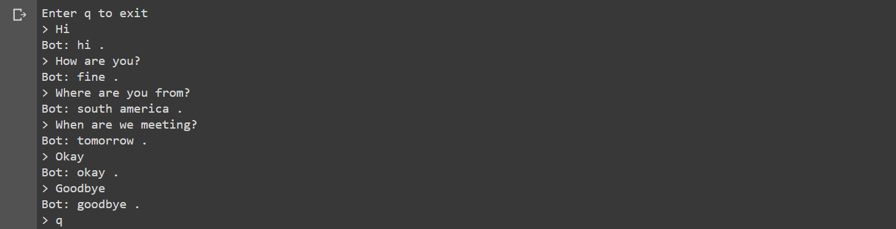

# Chatbot
A chatbot can be defined as an application of artificial intelligence that carries out a conversation with a human being via auditory or textual or means. Examples of auditory chatbots can be Samsung Bixby or Apple’s Siri and textual can be the telegram or messenger chatbots.

I used deep learning and in addition to that, the concept of NLP (Natural Language Processing), RNN (Recurrent Neural Networks) & LSTM (Long-Short-Term-Memory) and finally made use of the seq2seq model architecture to implement the chatbot.

Dataset Used-
http://www.cs.cornell.edu/~cristian/Cornell_Movie-Dialogs_Corpus.html

Requirements:
Python
Pytorch
nltk

How to implement-
1)Download the data ZIP file from the above link and put in a data/ directory under the current directory.
2)Run chatbot.ipynb 

Results-

